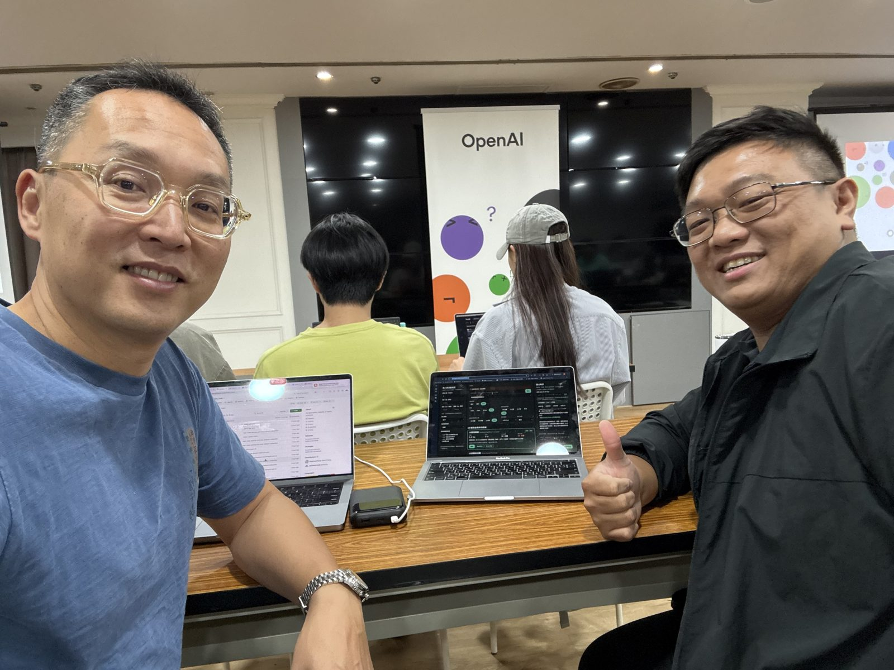

# 台北任你/妳跑 · Taipei Trails

**線上版：https://trails.angus-chen.com**

大台北跑步與健行路線推薦，加上 AI 登山助手。輸入出發地（飯店、捷運站或座標）、想跑多遠（3／5／10 公里）、有多少時間，立刻找出最適合的路線，由近到遠排列，並可與 AI 討論裝備、飲水、食物與交通。

> **English:** Only an hour free in Taipei? 台北任你/妳跑 finds the run or hike that fits your time, distance and hotel location, then lets you plan gear, water, food and transport with an AI hiking assistant. Live at https://trails.angus-chen.com, with an iPhone version on TestFlight.



*2026 年 10 月，在台北的 OpenAI 活動現場開發本專案。*

## 要解決的問題

出差或旅行到台北，行程滿檔，好不容易空出一小時，想去跑步或爬山，卻不熟悉這座城市：飯店附近有哪條步道？5 公里的路線來得及在下個會議前跑完嗎？查地圖、看部落格和評論，寶貴的時間就這樣溜走。本專案一鍵給出答案，連交通時間都算好。

## 技術說明

網頁版保留跑步／健行距離、時間、出發地篩選，右側聊天 sidebar 以 **LangChain JS `createAgent` + OpenAI API** 回答路線、裝備、飲水、食物份量與交通問題。手機用右下角按鈕開啟聊天。

本專案包含兩個版本：

- `index.html` 與 Node.js 後端：網頁版，提供中英文步道篩選與 AI 登山助手。
- `testflight/`：原生 iPhone App，透過 TestFlight 發佈，提供 GPS 定位、Apple Maps 飯店查詢、捷運站選擇與中英文切換。建置與上傳方式見 [testflight/README.md](testflight/README.md)。

## 本機啟動

需要 Node.js 22 以上。

```sh
npm install
cp .env.example .env
# 在 .env 填入 OPENAI_API_KEY
npm start
```

開啟 http://127.0.0.1:3000。`OPENAI_MODEL` 預設 `gpt-4.1-mini`，可改成帳戶可用且支援 tool calling 的 OpenAI 模型。`npm run dev` 啟用 Node watch；`npm test` 執行不消耗 API 額度的測試。

## 線上部署（Vercel）

正式站 https://trails.angus-chen.com 部署在 Vercel（Qerberos 團隊，專案 `taipei-trails`），每次推送到 `main` 會自動重新部署。

- `api/chat.js`、`api/health.js`：Vercel Functions，透過 `api/_handler.js` 共用 `server/index.js` 的同一套請求處理邏輯。
- `vercel.json`：函式逾時設定（聊天 60 秒）；`.vercelignore` 排除 `testflight/`、`test/`、`docs/`。
- 環境變數 `OPENAI_API_KEY`、`OPENAI_MODEL` 只設定在 Vercel 專案設定中，不進入程式碼或 Git。
- 網域：Cloudflare DNS 以 CNAME `trails` 指向 Vercel（DNS only）。

API key 只在 Node.js 伺服器讀取；靜態檔案採白名單，不提供 `.env`、伺服器程式或依賴目錄。聊天需要後端，因此 GitHub Pages 單獨託管不能執行 AI。

## 語言切換

頁面頂部的「語言／Language」下拉選單提供 **繁體中文（預設）** 與 **English**。切換會立即更新介面、18 條步道的顯示名稱／說明、捷運提示、聊天快捷問題與錯誤訊息，並以 `ttf-locale` 保存於 localStorage。篩選條件、出發地與聊天內容會保留；既有使用者／AI 訊息維持原文，後續 AI 回覆預設使用當次送出時的介面語言。

翻譯集中於 `locales/zh-Hant.js`、`locales/en.js` 與 `locales/trails-zh-Hant.js`，`i18n.js` 管理切換與格式化。`POST /api/chat` 可傳入 `locale: "zh-Hant" | "en"`，未傳入時使用繁體中文；API 錯誤包含可供前端翻譯的 `code`。

## 使用

1. 在左側個人設定填入活動人數（含自己，1–20 人），選填自己的年齡、身高與體重，選擇新手／老手／專家及輕鬆／適中／挑戰的活動強度偏好；中央設定出發地、距離與時間。
2. 用「我的裝備與習慣」這一個文字框填入背包容量、平常帶水量、已有裝備及休息等習慣（最多 1,500 字）。設定自動儲存在此瀏覽器的 `ttf-profile`，每次送出聊天會帶給 AI；手機顯示於行程上方。
3. 在步道卡片按「與 AI 討論」，或直接輸入「我是新手，想去北投，三公里以內」。
4. 追問「要帶多少水與食物？」「裝備各帶多少？」「搭大眾運輸怎麼去？」。份量工具預設使用左側活動人數；對話明確指定的人數優先。
5. 聊天區的推薦卡可選為對話中的步道；「新對話」清除聊天與路線選取，保留個人設定。
6. 左側設定與右側聊天標題旁的箭頭可各自收合面板，再點窄邊條展開；中央路線區會自動放寬。開合偏好保存於 `ttf-sidebars`，收合保留設定與當頁聊天。手機設定收合為橫列，聊天由右下角按鈕開啟；點「與 AI 討論」會自動展開聊天。

每次請求傳送最多最近 20 則訊息與目前路線／篩選條件。聊天暫存在頁面記憶體，重新整理會清除；原有出發地與篩選設定仍保存於 localStorage。

## AI 實作

- `server/chat.js`：LangChain agent，每次請求建立獨立工具狀態。工具為 `search_trails`、`get_trail`、`plan_preparation`、`plan_transport`。
- `server/planning.js`：以程式執行區域、能力、距離／時間上限查詢和份量計算；模型負責理解問題與解釋結果。
- `trails.js`：前後端共用的 18 條原有示範路線。包含跑步路線；AI 登山推薦只使用 hike/both 路線。
- `server/contracts.js`：Zod 驗證 HTTP 邊界。
- `chat-ui.js`：聊天、多輪對話、路線上下文、安全文字與連結呈現。
- `profile-ui.js`：左側個人／活動設定、欄位驗證與瀏覽器保存；個人設定隨請求送到 agent 背景。
- `sidebar-ui.js`：左右面板的展開／收合、開合偏好與鍵盤焦點。
- `server/index.js`：本機 Node HTTP 伺服器，`POST /api/chat`、`GET /api/health`。

聊天路線查詢的距離／時間是嚴格上限，能力不符的路線不會回傳。原有主清單仍使用原本的距離容許範圍、時間公式與出發地粗估排序；sidebar 的推薦與主清單不一定一致。

可選的 Langfuse tracing 需填入 `.env.example` 中三個 `LANGFUSE_*` 設定。後端啟用 OpenTelemetry，為每次 agent invocation 建立獨立 Langfuse callback。預設不傳送 tracing；啟用後對話與工具資料會送到所設定的 Langfuse 專案。

## 資料與目前限制

- 原有距離、爬升、座標沒有官方來源逐條核對；新加的行政區、能力分級是初版專案標籤，非官方評級。步道覆蓋以台北市為主，新北仍很少。
- 健行時間依距離、爬升粗估，未包含休息。專家不自動獲得更快的時間估算。
- 活動強度是規劃偏好，AI 參考既有路線距離、爬升與時間說明；不新增官方強度評級。年齡、身高、體重不會自動推定經驗或套用個人生理公式。裝備習慣由 AI 參考，不改寫工具的基本飲水估算。
- 飲水攜帶量以每小時 0.5 公升作為起點，炎熱／天氣未知用 0.5～1 公升範圍，加 0.5 公升備用水後進位。點心與餐食份數是專案打包估算，非營養處方。會依時長與人數提供每人與團體數量。
- 行前準備參考 [NPS Hiking Safety](https://www.nps.gov/grsm/planyourvisit/hikingsafety.htm) 與 [NPS Ten Essentials](https://www.nps.gov/articles/10essentials.htm)。美國公園建議僅作為一般規劃參考，不能代表某條台灣步道的即時情況。
- 交通只提供既有附近捷運／轉乘提示與 Google Maps 導航，沒有即時班次、車資、停車資料。
- 尚未實作大台北互動地圖、實際路線軌跡、官方路況／封閉公告、即時天氣、持久化聊天與登入。
- 原有飯店名稱查詢仍依賴 Claude 環境的 `window.claude.use`；一般瀏覽器請用座標、包含座標的 Google Maps 網址或捷運站。尚不支援短網址解析或正式地理編碼 API。

本機伺服器預設僅綁定 `127.0.0.1`。線上版已透過 Vercel 提供 HTTPS，但聊天仍是公開的且尚無用量限制，請在 OpenAI 帳戶設定每月花費上限。

## 文件

目前需求完成狀態見 [docs/status.md](docs/status.md)。
